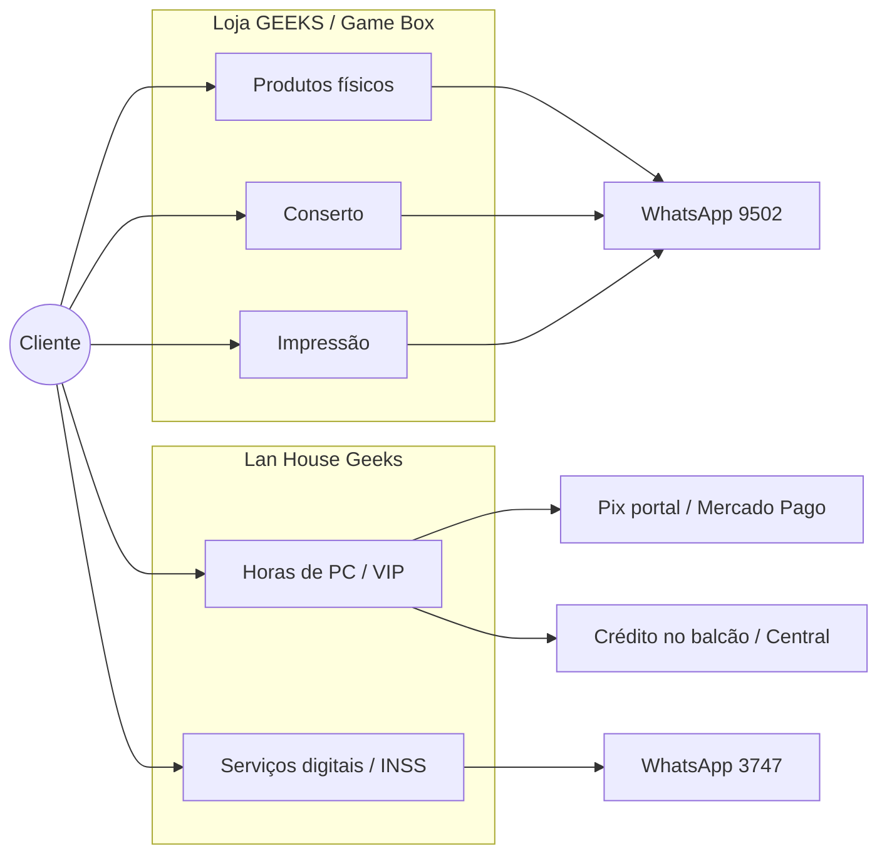
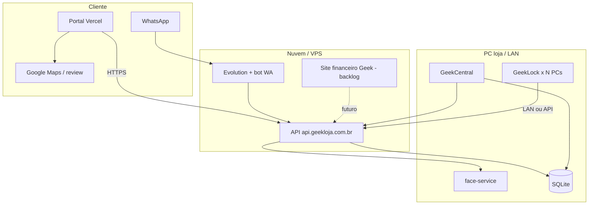

# Negócio Geek — mapa canônico

Atualizado em **2026-10-03**.  
Público: **dono** (+ Cursor). Modo balcão (versão simples) fica para depois.

Índice ops do dia a dia: [`PENDENCIAS.md`](./PENDENCIAS.md) · índice docs: [`README.md`](./README.md) · vivo vs arquivo: [`VIVO-VS-ARQUIVO.md`](./VIVO-VS-ARQUIVO.md)  
**Redes (posts, respostas, contas Google/Meta/WA):** [`redes/README.md`](./redes/README.md)

---

## Em uma frase

Três pontos físicos em Paulo Afonso (BA) sob a marca **Geeks**: venda de produtos geek/celular, lan house com PCs travados por **GeekLock**, e serviços (digitais, conserto, impressão). O software amarra VIP, horas, Pix, WhatsApp e avaliação no Google.

---

## Unidades

| Unidade | Endereço (centro) | Oferta | WhatsApp |
|---------|-------------------|--------|----------|
| **Loja GEEKS** | R. Santo Antônio, 6 | Celular, games, colecionáveis; **conserto**; **impressão** | `(75) 99186-9502` |
| **Game Box** | Av. Getúlio Vargas | Games e acessórios | mesmo da loja (atendimento) |
| **Lan House Geeks** | R. Mal. Rondon | PCs + GeekLock, horas VIP, serviços digitais / INSS | `(75) 98860-3747` |

Avaliação Google (Loja GEEKS — escrever review):  
`https://search.google.com/local/writereview?placeid=ChIJrcvudQAxCQcRkpS8xkTbkg0`  
Landing QR: https://loja-geek-portal.vercel.app/avaliar

---

## Como o dinheiro entra (sem metas)

- **Produto / conserto / impressão:** balcão + WhatsApp da loja; ainda **não** passam por um ERP Geek.
- **Horas / assinatura:** GeekCentral (Caixa / Liberar) ou portal Pix → saldo VIP.
- **Caixa do Central** hoje = PDV de **horas/VIP**, não o financeiro completo da empresa.

---

## Sistemas (software)

| Peça | Papel | Onde |
|------|--------|------|
| **GeekCentral** | Cadastro VIP, estações, Liberar, Caixa horas, admin celular | PC loja / release Windows |
| **GeekLock** | Trava PC até VIP / liberação do balcão | Estações |
| **API Fastify** | Motor (sessões, Pix, WhatsApp hooks, updates) | Loja + espelho VPS `api.geekloja.com.br` |
| **Portal** | Site cliente: saldo, Pix, enroll, `/avaliar` | Vercel `loja-geek-portal` |
| **Evolution + bot** | WhatsApp com supervisão / FAQ | Repo `loja-geek-whatsapp` · VPS |
| **Finanças da Família** | App **pessoal** — **não** é o caixa da Geek | Repo separado |

Repo irmão oficial no mapa: **`/home/treegunn/loja-geek-whatsapp`** (também em `/opt/loja-geek-whatsapp` na VPS).

---

## Quem usa o quê

| Papel | Ferramenta | Onde |
|-------|------------|------|
| Dono | Central, admin remoto, painel WA, portal | Casa ou loja |
| Equipe balcão | Central (Liberar / Caixa), WhatsApp | Só Wi‑Fi da loja no admin remoto |
| Cliente VIP | Portal, face no PC, WhatsApp | Celular / estação |
| Cliente avulso | Balcão, WA, Maps | Sem cadastro facial |

Detalhe de papéis: [`GEEKADMIN-CELULAR.md`](./GEEKADMIN-CELULAR.md).

---

## Próximos ~30 dias (foco)

1. **Pix portal ponta a ponta** — webhook + compra real confirmada.  
2. **Avaliações Google** — link writereview + pedido educado no WhatsApp (pós Pix/venda; cooldown 60d; flag “não pedir”).  
3. **Estabilidade Central/Lock** — IP `.70`, WS, updates das estações, túnel UI alinhada.

---

## Redes sociais (agora)

- Rascunhos IG/FB/Maps + guia de contas: [`redes/`](./redes/).  
- WhatsApp: Evolution na VPS; FAQ pode ser auto; resto com supervisão humana.  
- Publicação automática IG/FB/Maps: só depois do checklist em [`redes/CONTAS-E-ACESSOS.md`](./redes/CONTAS-E-ACESSOS.md).

## Backlog ~6 meses (sem data)

- **Site financeiro Geek** (app **separado**, Vercel): entradas/saídas, contas a pagar, **multi-unidade** (Loja / Game Box / Lan); dono + 1–2 do balcão. Ligar à API Geek (horas/Pix) depois. **Não** misturar com Finanças da Família.  
- Quiosque Windows / fechar sessão Steam limpa.  
- APIs Meta / Google Business para publicar e responder sem colar na mão.  
- Assinatura / planos mensais mais claros.  
- Litestream / monitoramento extra.  
- Multi-unidade GeekLock se abrir 2ª sala de PCs.

---

## Fora de escopo (por enquanto)

- Saber se o cliente **publicou** a avaliação no Google (API não casa com telefone).  
- PDV de estoque de produto físico dentro do GeekLock.  
- Misturar finanças pessoais com caixa da loja.
